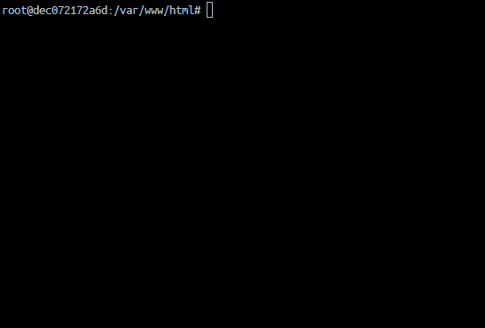

# Prueba técnica - Kaira - Acortador de urls:

## Ejecución del entorno con docker

```shell 
cd docker
docker-compose -p web-app up -d
```

## Ejecución de los casos de prueba

* Se definen casos de prueba a nivel de integración para ejercitar los diferentes estados de rechazo y uno de éxito.
* Se definen dos casos unitarios, un test doble para validar la comunicación con el servicio __tinyurl.com__ y otro para la verificación del token.

Ejecución de las pruebas:
```shell 
php artisan test
```



## Consideraciones

No se ha implementado ningúna arquitectura basada en __Porst & adapters__ o similar por motivos de sobreingreniería. 
Se implementa un contrato y un servicio para la solicitud HTTP al proveedor y un helper para la validación morfolófica del token de autorización.
